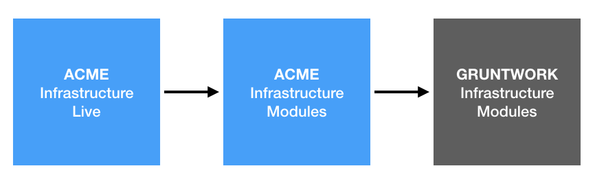

# How the code is organized

Now that you have an idea of [what the architecture looks like](01-architecture-overview.md), [what's
deployed](02-whats-deployed.md), and [security compliance](03-security-compliance-compatibility.md) it's time to look
into how the code is organized.



* [infrastructure-live-multi-account-acme](#infrastructure-live-multi-account-acme)
* [infrastructure-modules-multi-account-acme](#infrastructure-modules-multi-account-acme)
* [Gruntwork Infrastructure as Code Library](#gruntwork-infrastructure-as-code-library)
* [Sample apps](#sample-apps)


## infrastructure-live-multi-account-acme

The repo you're looking at now is called `infrastructure-live-multi-account-acme`. This repo represents the live, deployed 
state of your AWS account(s). This code "instantiates" the modules in the infrastructure-modules-multi-account-acme repo
(described in the next section) in each of your environments (stage, prod, etc), setting the input variables for the 
module with values appropriate for that environment.
  
This repo uses the following file/folder layout:
 
```
<account>
 └ _global
 └ <region>
    └ _global
    └ <environment>
       └ <resource>
         └ terragrunt.hcl
```

The hierarchy of folders is as follows:

* **Account**: At the top level are each of your AWS accounts, such as `stage`, `prod`, `shared-services`, etc. If you 
  have everything deployed in a single AWS account, there will just be a single folder at the root (e.g. `main`).
  
* **Region**: Within each account, there will be one or more [AWS 
  regions](http://docs.aws.amazon.com/AWSEC2/latest/UserGuide/using-regions-availability-zones.html), such as 
  `us-east-1`, `eu-west-1`, and `ap-southeast-2`, where you've deployed resources. There may also be a `_global` 
  folder that defines resources that are available across all the AWS regions in this account, such as IAM users, 
  Route 53 hosted zones, and CloudTrail. 

* **Environment**: Within each region, there will be one or more "environments", such as `qa`, `mgmt`, etc. Typically, 
  an environment will correspond to a single [AWS Virtual Private Cloud (VPC)](https://aws.amazon.com/vpc/), which 
  isolates that environment from everything else in that AWS account. There may also be a `_global` folder 
  that defines resources that are available across all the environments in this AWS region, such as Route 53 A records, 
  SNS topics, and ECR repos.
  
* **Resource**: Within each environment, you deploy all the resources for that environment, such as EC2 Instances, Auto
  Scaling Groups, ECS Clusters, Databases, Load Balancers, and so on. The deployment is done using 
  [Terragrunt](https://github.com/maxar-infrastructure/terragrunt), which is a thin wrapper for Terraform that helps keep your
  code DRY and maintainable.

The reason we keep each account, region, and environment in separate Terraform templates in separate folders is for 
**isolation**. This reduces the chances that when you're fiddling in, say, the staging environment in `us-west-2`, you 
accidentally break something in the prod environment in `us-east-1`. In fact, our setup also ensures that Terraform 
will store the [state of your infrastructure](https://www.terraform.io/docs/state/) in separate files for each 
environment too, so in the (very rare) case that you totally corrupt your state in the stage environment, your prod 
environment should keep running just fine. Moreover, small modules run faster, the `plan` output is easier to read,
permissions management is easier, testing is easier, and so on. See [Lessons Learned From Writing Over 300,000 Lines of
Infrastructure Code](https://blog.gruntwork.io/5-lessons-learned-from-writing-over-300-000-lines-of-infrastructure-code-36ba7fadeac1)
for more info.


## infrastructure-modules-multi-account-acme

This infrastructure-modules-multi-account-acme repo contains all of Acme Multi Account's infrastructure code, broken down
into modules. Think of each module as an opinionated "blueprint" for how to deploy a particular piece of 
infrastructure. Each module is meant to be reused across multiple environments, so any setting that may differ from 
environment to environment is exposed as an input variable. 

The advantages of this approach are:

1. You can define reusable pieces of infrastructure in modules.
2. You can test each module in isolation.
3. You can version each module separately and thereby experiment with different versions of your infrastructure in
   different environments (e.g. try a new database in staging before production).

The modules are configured for and deployed to each environment in the infrastructure-live-multi-account-acme repo, as
described in the previous section. Under the hood, many of the modules in the infrastructure-modules-multi-account-acme repo 
make use of Gruntwork modules, as described in the next section.


## Gruntwork Infrastructure as Code Library

The [Gruntwork Infrastructure as Code (IaC) Library](https://gruntwork.io/infrastructure-as-code-library/) is a 
collection of over 300,000 lines of reusable, battle-tested, production-grade infrastructure code for AWS, GCP, and 
Azure. Many of the modules in the infrastructure-modules-multi-account-acme repo are using modules from the Gruntwork IaC
Library under the hood. 

Check out [How to use the Gruntwork Infrastructure as Code Library](https://gruntwork.io/guides/foundations/how-to-use-gruntwork-infrastructure-as-code-library/)
for a detailed guide of how the IaC Library is designed and how to use it.


## Sample apps

The Reference Architecture may include include sample applications that show best practices for building, packaging, 
and deploying applications:

* **[sample-app-frontend-multi-account-acme](https://github.com/maxar-infrastructure/sample-app-frontend-multi-account-acme)**: A sample frontend app.
* **[sample-app-backend-multi-account-acme](https://github.com/maxar-infrastructure/sample-app-backend-multi-account-acme)**: A sample backend app.
* **[lambda examples](https://github.com/maxar-infrastructure/infrastructure-modules-multi-account-acme/tree/master/lambda)**: Sample lambda functions.


## Next steps

Now that you know how to find the code, let's talk about how to [Run an App in the Dev
Environment](05-dev-environment.md).
